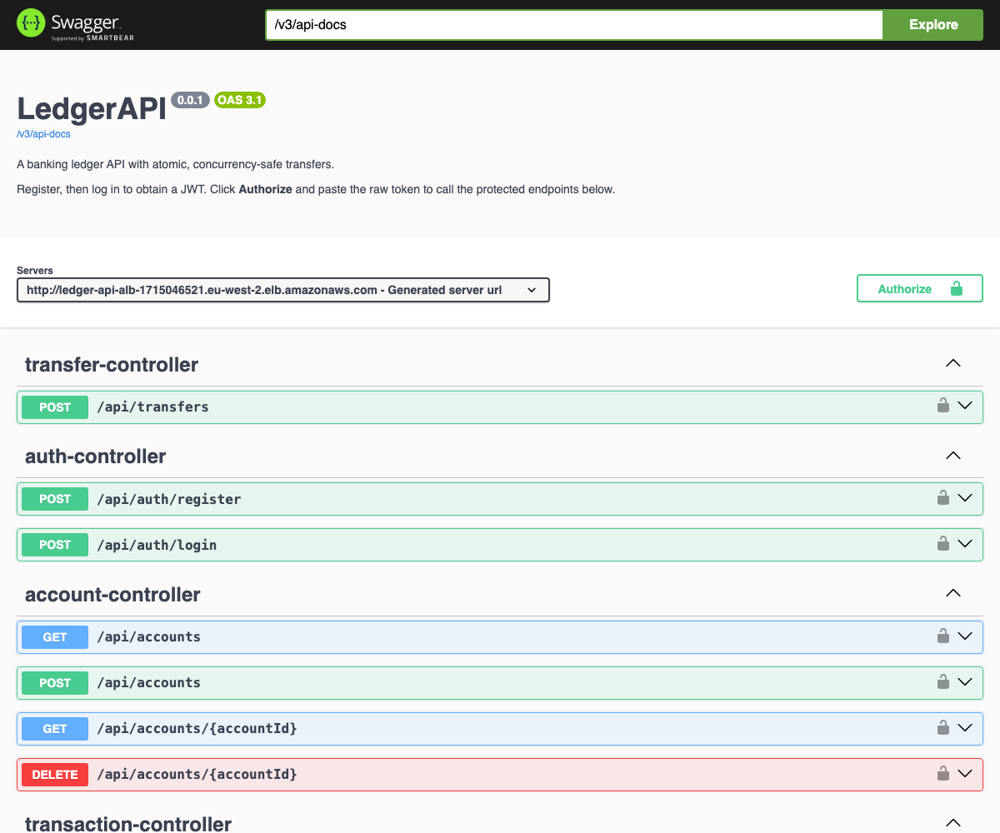
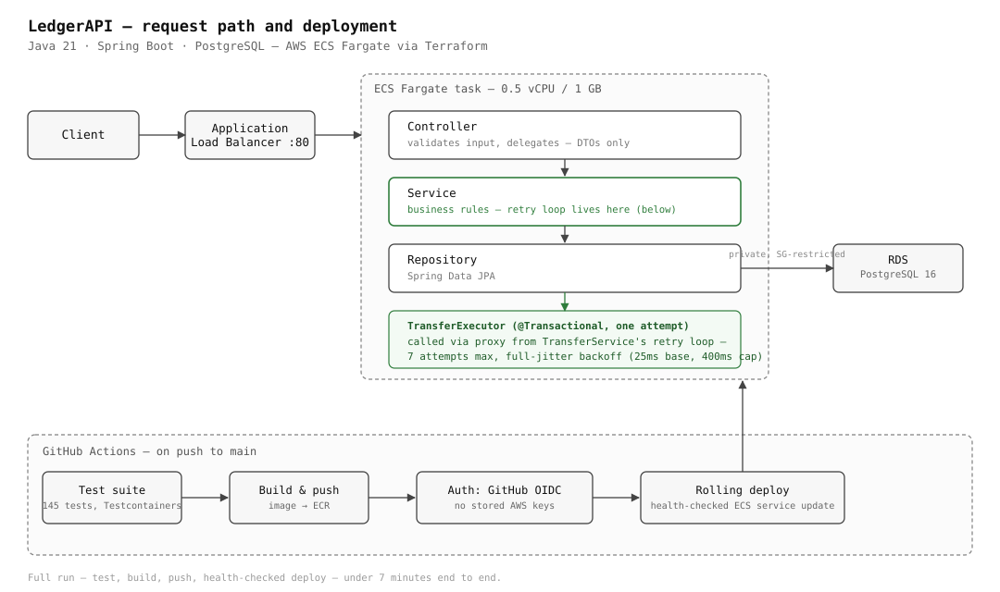

# LedgerAPI

[](https://github.com/edwardmagongo/LedgerAPI/actions/workflows/deploy.yml)
[](LICENSE)


A banking ledger REST API in Spring Boot: accounts, deposits and withdrawals, and
account-to-account transfers that are atomic and safe under concurrent load.

The interesting part is not the CRUD — it is that concurrent transfers against the same account
provably cannot corrupt a balance, and there are automated tests that fail if that stops being true.

## Highlights

- **Concurrency correctness, proven, not assumed.** Optimistic locking with a bounded, jittered
  retry loop prevents lost updates on concurrent transfers — verified by tests that were confirmed
  to **fail** when the locking is removed. See [Concurrency safety](#concurrency-safety).
- **145 automated tests, 96% line coverage** — unit, Testcontainers-backed integration, and a
  dedicated concurrency suite that hammers a single account with real thread contention, not
  mocked-away race conditions.
- **Measured, not estimated, performance.** [`scripts/loadtest.mjs`](scripts/loadtest.mjs) drives
  the live API and reports real throughput and latency under contention. See [Performance](#performance).
- **Idempotency keys with request fingerprinting** on every money-moving endpoint, backed by a
  database unique constraint — safe retries for a client that cannot tell whether a timed-out
  request actually landed. See [Idempotency](#idempotency).
- **Infrastructure as code, deployed for real.** Terraform provisions the full AWS stack (ECS
  Fargate, RDS, ALB, IAM, OIDC federation); GitHub Actions tests, builds, and deploys on every push
  to `main`, authenticating with zero long-lived AWS credentials. See [Deployment](#deployment).
- **Proven across processes, not just threads.** The concurrency guarantee above holds when
  concurrent transfers land on different application instances, not only different threads in one
  JVM — verified by a script, and by a chaos test that kills an instance mid-transfer. See
  [Multi-instance concurrency](#multi-instance-concurrency) and [Chaos testing](#chaos-testing).

## Live Demo

**[Try it in your browser →](http://ledger-api-alb-1715046521.eu-west-2.elb.amazonaws.com/swagger-ui.html)**
(interactive Swagger UI against the live deployment — register a user, log in, and call the
endpoints directly)



Running on AWS ECS Fargate, provisioned entirely by the Terraform in [`infra/`](infra/) and shipped
by the GitHub Actions pipeline in [`.github/workflows/deploy.yml`](.github/workflows/deploy.yml) —
details in [Deployment](#deployment).

This is a portfolio demo, not a production service. If the link is down, the stack was torn down
between reviews to control cost (`terraform destroy` is one command); `docker compose up --build`
reproduces the identical API locally in under a minute.

## Table of Contents

- [Stack](#stack)
- [Running it](#running-it)
- [Trying it](#trying-it)
- [Architecture](#architecture)
- [Concurrency safety](#concurrency-safety)
- [Multi-instance concurrency](#multi-instance-concurrency)
- [Chaos testing](#chaos-testing)
- [Observability](#observability)
- [Tests](#tests)
- [Performance](#performance)
- [API](#api)
- [Idempotency](#idempotency)
- [Design decisions and limits](#design-decisions-and-limits)
- [Configuration](#configuration)
- [Deployment](#deployment)
- [License](#license)

## Stack

Java 21 · Spring Boot 3.5.3 · Spring Data JPA · Spring Security (JWT) · PostgreSQL 16 · Flyway ·
JUnit 5 · Mockito · Testcontainers · springdoc-openapi · Docker · Terraform · AWS (ECS Fargate,
RDS, ALB, IAM/OIDC) · GitHub Actions

## Running it

Requires Docker and (for running the tests locally) JDK 21.

```bash
docker compose up --build
```

- API: <http://localhost:8080>
- Swagger UI: <http://localhost:8080/swagger-ui.html>
- Health: <http://localhost:8080/actuator/health>

Run the test suite (Testcontainers starts its own throwaway Postgres, so Docker must be running —
it does not use the Compose database):

```bash
./mvnw test
```

## Trying it

```bash
# register and log in
curl -s -X POST localhost:8080/api/auth/register -H 'Content-Type: application/json' \
  -d '{"email":"alice@example.com","password":"s3cretpassword"}'

TOKEN=$(curl -s -X POST localhost:8080/api/auth/login -H 'Content-Type: application/json' \
  -d '{"email":"alice@example.com","password":"s3cretpassword"}' | jq -r .token)

# open an account, fund it, check the balance
ACCOUNT=$(curl -s -X POST localhost:8080/api/accounts -H "Authorization: Bearer $TOKEN" \
  -H 'Content-Type: application/json' -d '{"currency":"GBP"}' | jq -r .id)

curl -s -X POST localhost:8080/api/accounts/$ACCOUNT/deposit -H "Authorization: Bearer $TOKEN" \
  -H 'Content-Type: application/json' -d '{"amount":500.00}'
```

## Architecture

```
HTTP  →  Controller  →  Service  →  Repository  →  PostgreSQL
             │             │
       DTOs only     business rules
```



- **Controllers** validate input and delegate. No business logic.
- **Services** hold the rules. JPA entities never cross the controller boundary — every response
  is a DTO record.
- **Repositories** are Spring Data JPA interfaces.
- **Flyway** owns the schema; Hibernate runs with `ddl-auto=validate` and will refuse to start if
  the entities and the migrations disagree.

| Package | Contents |
|---|---|
| `auth` | User, registration, login, JWT issuing and filter |
| `account` | Account entity, ownership-scoped CRUD |
| `transaction` | Transaction ledger entity, deposits, withdrawals, history |
| `transfer` | The transfer executor and its retry orchestrator |
| `common` | Error shape, domain exceptions, the shared conflict retry |
| `config` | Security filter chain, OpenAPI |

### Data model

`User 1—* Account 1—* Transaction`

A transfer writes **two** `Transaction` rows — a `TRANSFER_OUT` on the source and a `TRANSFER_IN`
on the destination — sharing one `transferId`, in the same transaction as the two balance updates.
Balance is a maintained column with the transaction log as its audit trail; the concurrency tests
assert the two reconcile.

## Concurrency safety

This is the part worth reading.

### The problem

Two transfers hitting the same account at once both read balance `100`, both compute `100 - 30`,
and both write `70`. One debit vanishes. The ledger is now wrong, and nothing errored.

### The approach: optimistic locking with a retry outside the transaction

`Account` carries a `@Version` column. Hibernate includes the version in the `WHERE` clause of
every `UPDATE` and increments it. If another transaction got there first, zero rows match, and
Hibernate raises `ObjectOptimisticLockingFailureException` instead of silently overwriting.

The structural detail that makes this actually work:

- **`TransferExecutor`** is `@Transactional` and performs exactly **one** attempt.
- **`TransferService`** is **not** transactional. It owns the bounded retry loop and calls
  `TransferExecutor` — **a separate bean**.

Both of those are load-bearing, and getting either wrong is the classic Spring bug in this
scenario:

1. An optimistic-lock failure surfaces at **flush/commit** — as the transactional method exits.
   A `try/catch` *inside* that method would never see it. Force a `flush()` to raise it early and
   the transaction is already rollback-only with an unusable persistence context.
2. Calling `this.executeOnce(...)` from within the same bean bypasses the Spring proxy, so
   `@Transactional` would silently not apply at all.

Because the retry sits outside the boundary and goes through the proxy, every attempt starts a
genuinely new transaction and re-reads current state. Retries are bounded at 7 attempts with full
jitter backoff — each attempt sleeps a random duration between 0 and an exponentially growing cap
(25ms base, capped at 400ms), so competing threads decorrelate rather than retrying in lockstep;
exhausting them returns `409`.

Only write conflicts are retried. Business rejections — insufficient funds, closed account,
currency mismatch — propagate immediately, so a real `422` never gets retried into a misleading
`409`.

### Deadlocks

Optimistic locking removes the application-held lock but not Postgres's row locks at `UPDATE`
time, so concurrent `A→B` and `B→A` transfers could still deadlock (`40P01`). The mitigation is
`hibernate.order_updates=true`, which sorts flush-time `UPDATE` statements by primary key —
giving concurrent transfers in opposite directions a deterministic statement order regardless of
the order application code mutates the entities in. Deadlocks that still occur are retried like
any other write conflict.

### Defence in depth

`accounts.balance` carries a `CHECK (balance >= 0)` constraint. The service rejects overdrafts
with a `422` long before that — but if a concurrency bug ever slipped through, the database
refuses the write rather than storing a negative balance.

### Why not pessimistic locking?

`SELECT ... FOR UPDATE` is simpler — no retry loop, no lost-update window. It was rejected
because it serializes every writer on an account row for the whole read-validate-write window,
which hurts throughput under contention. Optimistic locking trades that for retry logic and a
small chance of a client-visible `409` under heavy single-account contention. For a ledger where
contention on any one account is normally low, that is the better trade. Under sustained
contention on a single hot account, pessimistic locking would be the better choice.

## Multi-instance concurrency

`TransferConcurrencyTest` proves the locking holds across threads in one JVM. That's not
the same claim as correctness across separate **processes**, which is what actually
happens once this is scaled out — a real deployment doesn't guarantee two concurrent
requests land on the same instance.

```bash
docker compose --profile multi up -d --build postgres app1 app2 app3
node scripts/multiinstance-test.mjs
```

[`scripts/multiinstance-test.mjs`](scripts/multiinstance-test.mjs) runs the same contended
scenarios `TransferConcurrencyTest` runs in-JVM — 20-way contention on one account, and 20
concurrent overdraft attempts against a balance that only covers 5 — but round-robins each
request across three independently-running instances over HTTP, then reconciles balances
from the transaction log exactly as the JUnit test does. This has to be a script rather
than a JUnit test: `@SpringBootTest` starts one application per test JVM, so proving
cross-process correctness needs actually-separate running processes.

## Chaos testing

```bash
docker compose --profile multi up -d --build postgres app1 app2 app3
node scripts/chaos-test.mjs
```

[`scripts/chaos-test.mjs`](scripts/chaos-test.mjs) fires concurrent transfers across all
three instances and, partway through, kills one of them (`docker kill`) — then reconciles
balances afterward.

**What this proves:** the ledger never ends up in a corrupted state — the destination
balance always matches exactly `$5.00 × (number of successful transfers)`, and every
account's transaction log reconciles with its stored balance, whether or not the kill
lands mid-request.

**What this does not prove:** that no individual request ever fails. A request being
processed on the killed instance at the exact moment it dies has no way to complete —
there's no distributed transaction between the load balancer and the app. That's expected
and is not a bug: the client sees a clear connection failure rather than an ambiguous
outcome, and can safely retry using the [idempotency key](#idempotency) it should already
be sending for a money-moving request.

## Observability

`/actuator/prometheus` exposes Micrometer metrics, including three tied directly to the
concurrency story above:

| Metric | Type | What it shows |
|---|---|---|
| `ledger.transfer.retry.count{outcome="retried"}` | counter | Optimistic-lock/deadlock conflicts that triggered a retry |
| `ledger.transfer.retry.count{outcome="exhausted"}` | counter | Conflicts that exhausted all 7 attempts and surfaced as a `409` |
| `ledger.idempotency.replay.count` | counter | Requests served from a stored response instead of executed |
| `ledger.transfer.duration` | histogram | End-to-end duration of a conflict-guarded operation, including retries |

```bash
docker compose up -d --build
```

brings up Prometheus (`localhost:9090`) and Grafana (`localhost:3000`, anonymous admin
access for local dev) alongside the API, with a "LedgerAPI" dashboard already provisioned
— no manual setup. Run [`scripts/loadtest.mjs`](scripts/loadtest.mjs) or
[`scripts/multiinstance-test.mjs`](scripts/multiinstance-test.mjs) against it and watch the
retry-rate panel move in real time as contention happens.

## Tests

145 automated tests, 0 failures, 0 errors, 96% line coverage (93% branch) via JaCoco:

```bash
./mvnw test
```

`target/site/jacoco/index.html` has the full per-package breakdown after a run.

- **Unit** (Mockito, no database): balance rules, transfer validation, and the retry policy —
  including that business exceptions are *not* retried.
- **Integration** (Testcontainers, real Postgres, full stack): auth, ownership rules, and that a
  withdrawal beyond the balance returns `422` rather than a `500`.
- **Concurrency** (`TransferConcurrencyTest`) — the point of the project:
  - 20 threads transferring out of one account → exact expected balance, no lost updates
  - 20 sources fanning into one destination
  - bidirectional transfers, exercising lock ordering without deadlock
  - 20 concurrent overdraft attempts against a balance that only covers 5 → exactly 5 succeed and
    the balance never goes negative
  - concurrent deposits, all applied
  - every case recomputes the balance from the transaction log and asserts it reconciles

  These tests are deliberately **not** `@Transactional` — wrapping them in one outer transaction
  would remove the row contention and they would pass whether or not the locking worked. They were
  verified to **fail** when `@Version` is removed.

## Performance

The concurrency tests prove correctness; this measures the cost of it. `scripts/loadtest.mjs`
drives the running API directly (registers a user, opens two accounts, fires concurrent HTTP
requests) at concurrency 20 — the same figure the Hikari pool is sized for — so the numbers below
reflect the actual retry loop under real contention, not a synthetic estimate.

```bash
docker compose up -d postgres
SPRING_DATASOURCE_URL=jdbc:postgresql://localhost:5432/ledger ./mvnw spring-boot:run &
node scripts/loadtest.mjs
```

Measured on a developer laptop (not the AWS deployment, not production traffic) — three runs, one
JVM, local Postgres:

| Scenario | Concurrency | Throughput | p50 | p95 | p99 | Outcome |
|---|---|---|---|---|---|---|
| `GET /accounts/{id}` | 20 | ~3,700–4,100 req/s | ~3–5ms | ~12–14ms | ~30–42ms | read path, no contention |
| `POST /withdraw` | 1 | ~500–900 req/s | ~1–1.7ms | ~1.7–3ms | ~2.8–7.4ms | no contention baseline |
| `POST /withdraw`, same account | 20 | ~340–480 req/s | ~1–1.4ms | ~190–250ms | ~480–795ms | 99.25–100% succeed; rest `409` after 7 retries |
| `POST /transfers`, same source | 20 | ~190–425 req/s | ~1.3–2.2ms | ~260–625ms | ~690–1,023ms | 97.25–99.25% succeed |

The shape is the interesting part, not any single number: most requests land in low single-digit
milliseconds — only the ones that actually collide on the same row pay for a retry, and they pay
with a long tail (the `p99` climbing into the hundreds of milliseconds) rather than a corrupted
balance or a hung request. That tail is the full-jitter backoff working as designed: each retry
waits before trying again rather than immediately re-colliding.

Two additional checks the script runs on every pass:

- **20 concurrent requests, one `Idempotency-Key`, one transfer.** Across three runs this resolved
  to exactly one execution and the rest correctly rejected as in-flight or replayed — the
  destination balance moved by exactly the transfer amount, never a multiple of it.
- **Reconciliation.** After each run, the script re-fetches the full transaction history for both
  accounts, recomputes the balance from scratch, and diffs it against the stored column. Across
  ~1,000–1,400 transactions per run (including the deliberately-contended ones above), computed and
  stored balances matched exactly every time.

## API

Full interactive docs at `/swagger-ui.html` — or try the [live deployment](#live-demo).

| Method | Path | Notes |
|---|---|---|
| `POST` | `/api/auth/register` | Public |
| `POST` | `/api/auth/login` | Public, returns a JWT |
| `GET` | `/api/accounts` | Caller's accounts |
| `POST` | `/api/accounts` | Open an account |
| `GET` | `/api/accounts/{id}` | Must own |
| `DELETE` | `/api/accounts/{id}` | Soft close; balance must be zero |
| `POST` | `/api/accounts/{id}/deposit` | Must own; optional `Idempotency-Key` |
| `POST` | `/api/accounts/{id}/withdraw` | Must own; `422` if it would go negative; optional `Idempotency-Key` |
| `POST` | `/api/transfers` | Must own the **source**; destination may be another user's; optional `Idempotency-Key` |
| `GET` | `/api/accounts/{id}/transactions` | Paginated, filter by `from`/`to`/`type` |

Errors share one shape:

```json
{
  "timestamp": "2026-07-31T10:15:30Z",
  "status": 422,
  "error": "Unprocessable Entity",
  "message": "Insufficient funds",
  "path": "/api/transfers"
}
```

| Status | Meaning |
|---|---|
| `400` | Validation failure, self-transfer, currency mismatch |
| `401` | Missing/invalid token, or bad credentials |
| `403` | Account not owned by the caller |
| `404` | Account not found |
| `409` | Closed account, closing a non-empty account, or write conflict after retries |
| `422` | Insufficient funds |

## Idempotency

The three endpoints that move money accept an optional header:

```
Idempotency-Key: <any string, 1–255 chars>
```

Send the same key again and the original response is replayed verbatim instead of the money moving a
second time — which is what a client needs when a request times out and it cannot tell whether the
transfer happened.

| Situation | Result |
|---|---|
| No header | Unchanged behaviour; two identical requests move money twice |
| First use of a key | Runs normally; the response is recorded against the key |
| Same key, same request, already completed | The stored response, replayed byte-for-byte |
| Same key, **different** request | `409` — the key is already used with different parameters |
| Same key, first request still in flight | `409` — retry shortly |
| First attempt failed a business rule | The key is released and can be reused |

Keys are namespaced per user, so two callers can pick the same string without colliding. Reuse
against a different request is caught by a SHA-256 fingerprint of the request's semantically
meaningful fields (see [`RequestFingerprint`](src/main/java/com/edwardmagongo/ledgerapi/common/idempotency/RequestFingerprint.java)),
not just the key string — and enforcement is backed by a `UNIQUE (user_id, idempotency_key)`
database constraint, not an application-level check that a race could slip past.

Why the transaction boundaries matter: the claim row commits in its own transaction so a concurrent
duplicate can see it, and the money movement and the stored response commit *together*, so there is
no window in which money moved but the key does not know it.

Not built: automatic key expiry, and reconciliation of claims stranded by a process crash between
the two commits. That failure mode is safe — the money does not move — but the caller cannot learn
the outcome through that key.

## Design decisions and limits

- **Money** is `NUMERIC(19,4)`; request amounts are validated to at most 2 decimal places. Because
  inputs are constrained to the stored scale, no rounding mode exists anywhere in the money path.
- **Currencies** are a closed enum (`GBP`, `USD`, `EUR`). Cross-currency transfers are rejected —
  there is no FX.
- **Idempotency keys** are implemented on all three money-moving endpoints — see
  [Idempotency](#idempotency). Automatic key expiry is not.
- Out of scope: refresh tokens, login rate limiting, overdrafts, and event-sourced double-entry
  accounting.

## Configuration

| Variable | Default | Notes |
|---|---|---|
| `SPRING_DATASOURCE_URL` | `jdbc:postgresql://localhost:5432/ledger` | |
| `SPRING_DATASOURCE_USERNAME` | `ledger` | |
| `SPRING_DATASOURCE_PASSWORD` | `ledger` | |
| `LEDGER_JWT_SECRET` | insecure dev value | **Must be overridden outside local dev.** HS256 needs ≥ 256 bits. |

The Hikari pool is sized to 20 connections — matched to `TransferConcurrencyTest`'s 20 concurrent
threads so each can hold a connection rather than queuing, which was otherwise worsening
optimistic-lock retry collisions under test load.

## Deployment

**Live on AWS** — ECS Fargate behind an Application Load Balancer, RDS PostgreSQL 16, and secrets
in SSM Parameter Store, in `eu-west-2`. See [Live Demo](#live-demo) to try it, or
[`infra/`](infra/) for the Terraform.

```
Internet → ALB :80 → ECS Fargate task (0.5 vCPU / 1 GB) → RDS Postgres (private, SG-restricted)
```

GitHub Actions runs the test suite on every pull request and, on merge to `main`, builds the
image, pushes it to ECR, and rolls the ECS service forward — authenticating with **GitHub OIDC**,
so no AWS keys are stored in the repository or its secrets. A full run — test, build, push,
health-checked rolling deploy — takes under 7 minutes end to end.

Design notes worth reading before the code:

- **No NAT gateway.** Tasks run in public subnets with `assign_public_ip = true` for outbound
  reachability, which saves the ~$35/month a NAT costs while idle. The database is isolated by
  security group, not by subnet placement — it has no public IP and accepts traffic only from the
  task security group.
- **Terraform owns infrastructure; the pipeline owns the running image version.** The ECS service
  sets `lifecycle { ignore_changes = [task_definition, desired_count] }`, so `terraform apply`
  cannot roll back a deployment CI made.
- **GitHub's immutable OIDC subject claims.** Repositories created on or after 2026-07-15 embed
  numeric owner/repo IDs in the federated token's `sub` claim (`owner@id/repo@id`) instead of the
  mutable names, specifically to stop a renamed or recreated repo from inheriting another
  identity's trust. The IAM trust policy in [`infra/github-oidc.tf`](infra/github-oidc.tf) matches
  the ID form — diagnosed from the actual `AssumeRoleWithWebIdentity` denial in CloudTrail rather
  than guessed from documentation.
- **Single-AZ, HTTP only.** Deliberate: this is sized to be stood up for a demo and torn down in
  one command, not to be highly available. Multi-AZ RDS and an ACM certificate with an HTTPS
  listener are each a small, well-defined addition. Task count is not one of them anymore — see
  below.

The service normally runs 1 task (~$55/month while running continuously); `infra/scale.sh 3`
scales it to match the [multi-instance concurrency](#multi-instance-concurrency) and
[chaos testing](#chaos-testing) sections' local setup, for real, on the live ALB. Scale back down
with `infra/scale.sh 1`. See [`infra/README.md`](infra/README.md) for the full bootstrap runbook
and the "Scaling the service" section for why this is a script and not a Terraform variable.

## License

[MIT](LICENSE)
